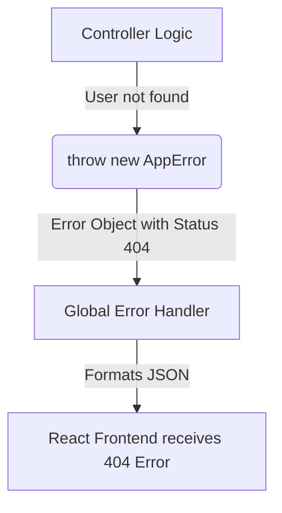

# Detailed Breakdown: `server/utils/AppError.ts`

## 1. Overview & Importance
This file defines a custom Error class named `AppError` that inherits from the default Node.js `Error` class. 

**What problem it solves:**
By default, standard Node.js errors only contain a text `message` and a `stack` trace. They do not understand the concept of HTTP status codes (like 404 for Not Found, or 401 for Unauthorized). By extending the default Error class, we create an error object that can hold a specific `statusCode`. This allows our Express application to easily communicate exactly what went wrong back to the frontend.

**Alternatives Considered:**
*   **Manual `res.status(400).json()`:** The beginner approach. Rejected because it forces us to write the same boilerplate response code hundreds of times across all our controllers.
*   **Throwing standard `new Error()`:** Rejected because it always results in a generic 500 Internal Server Error, making debugging impossible for the frontend.

---

## 2. Line-by-Line Breakdown

```typescript
export class AppError extends Error {
```
*   **Why we used it:** We use Object-Oriented Programming (OOP) inheritance here. `extends Error` means our custom class gets all the built-in behavior of a normal error, but we get to add our own custom properties to it.

```typescript
  public statusCode: number;
  public isOperational: boolean;
```
*   **Why we used it:** We declare the two new properties we are adding. `statusCode` will hold the HTTP number. `isOperational` is a flag we use to distinguish between "expected" errors (like a user typing the wrong password) versus "programming bugs" (like the database crashing).

```typescript
  constructor(message: string, statusCode: number) {
    super(message);
```
*   **Why we used it:** The `constructor` is the setup function. Calling `super(message)` passes the error message up to the parent `Error` class so it can handle the core message logic.

```typescript
    this.statusCode = statusCode;
    this.isOperational = true;
```
*   **Why we used it:** We assign the status code. We set `isOperational` to `true` by default because any time we manually throw an `AppError` in our code, it means we *expected* it could happen (e.g., we couldn't find a task ID).

```typescript
    Error.captureStackTrace(this, this.constructor);
  }
}
```
*   **Why we used it:** This is a neat V8 engine trick. It prevents the `AppError` constructor itself from showing up in the stack trace, keeping your logs clean and pointing exactly to the file where the error was thrown.

---

## 3. Data Flow



---

## 4. How it links to other files
*   **To `server/controllers/*.ts`:** Every single controller file will import this class to throw errors (e.g., `throw new AppError("Invalid credentials", 401)`).
*   **To `server/middleware/errorHandler.ts`:** That file specifically looks for the `statusCode` property that this class creates.
