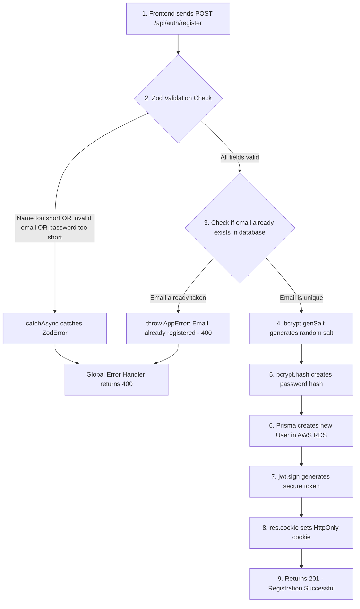
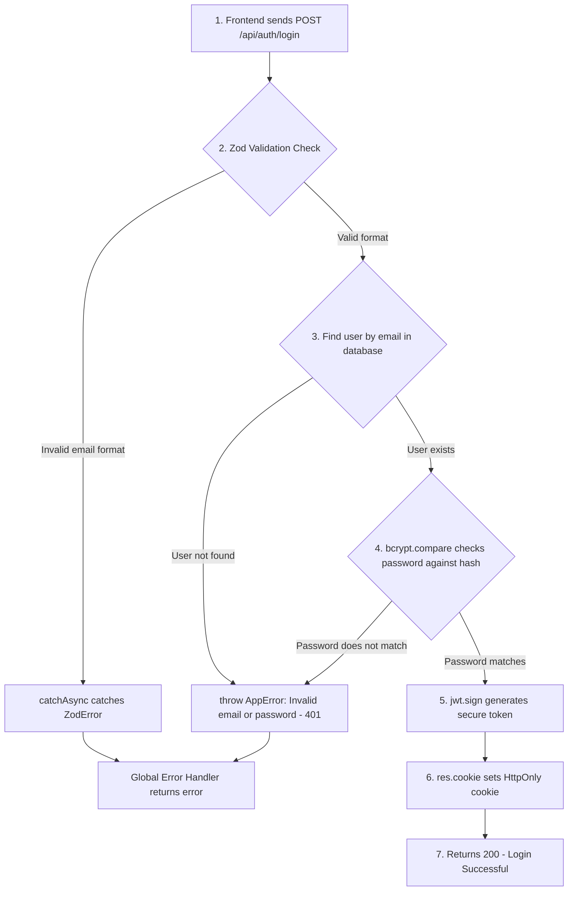
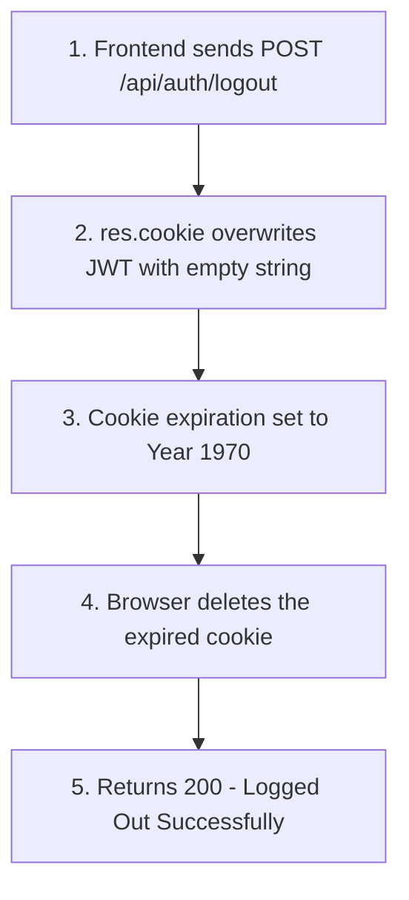

# Detailed Breakdown: `server/controllers/auth.ts`

## 1. Overview & Importance

This file contains the core business logic for our Authentication System. It handles three operations: Registering new users, Logging in existing users, and Logging out. This is the **Controller** in the MVC pattern.

**What problem it solves:**
In the old codebase, all authentication logic (validation, password hashing, JWT creation, database queries) was crammed inside a single 1000-line `server.ts` file alongside task logic, file logic, and message logic. By extracting authentication into its own dedicated controller, we achieve strict MVC separation. Each function does exactly one thing, is easy to test, and is easy to debug.

**Alternatives Considered:**

* **Passport.js:** A popular authentication library with "strategies" for Google, Facebook, etc. Rejected because it adds unnecessary complexity for a JWT-based email/password system. Building it ourselves teaches the underlying mechanics.
* **Auth0 / Clerk / Firebase Auth:** Third-party authentication services. Rejected because they hide the implementation details, which defeats the purpose of learning backend engineering. Also adds vendor lock-in.

---

## 2. Line-by-Line Breakdown

### Imports

```typescript
import { prisma } from '../lib/prisma';
import { catchAsync } from '../utils/catchAsync';
import { AppError } from '../utils/AppError';
import { registerSchema, loginSchema } from '../schemas';
```

* **Why we used it:** We import our entire professional infrastructure. `catchAsync` eliminates try/catch blocks. `AppError` gives us clean error throwing. The Zod schemas validate data before it touches the database. The Prisma singleton talks to AWS RDS.

### Registration Flow

```typescript
const validatedData = registerSchema.parse(req.body);
```

* **Why we used it:** This single line replaces 10+ lines of manual `if` statements. Zod's `.parse()` method checks every rule we defined (email format, password length >= 6, name length >= 2). If any rule breaks, Zod throws a `ZodError` which `catchAsync` catches and forwards to the Global Error Handler. If it passes, `validatedData` is fully typed and guaranteed safe.

```typescript
const existingUser = await prisma.user.findUnique({ where: { email: validatedData.email } });
if (existingUser) throw new AppError('Email is already registered', 400);
```

* **Why we used it:** We manually check for duplicate emails before attempting to create the user. While our database has a `@unique` constraint on email (which would also reject duplicates via Prisma error P2002), checking manually lets us return a much more user-friendly error message.

```typescript
const salt = await bcrypt.genSalt(10);
const passwordHash = await bcrypt.hash(validatedData.password, salt);
```

* **Why we used it:** We NEVER store plain text passwords. `bcrypt.genSalt(10)` generates a random string ("salt"). `bcrypt.hash()` combines the password with the salt and runs it through a one-way hashing algorithm 2^10 (1024) times. Even if our entire database is leaked, attackers cannot reverse-engineer the original passwords.

```typescript
const token = jwt.sign({ userId: user.id }, process.env.JWT_SECRET!, { expiresIn: '7d' });
```

* **Why we used it:** After creating the user, we generate a JSON Web Token. We embed only the `userId` inside it (not the email or password). The token is mathematically signed using our secret key from `.env`. It automatically expires in 7 days, forcing users to re-login periodically for security.

```typescript
res.cookie('jwt', token, {
  httpOnly: true,
  secure: process.env.NODE_ENV !== 'development',
  sameSite: 'strict',
  maxAge: 7 * 24 * 60 * 60 * 1000,
});
```

* **Why we used it:** This is the most critical security upgrade in the entire project. Instead of sending the JWT back as JSON (where the React frontend would store it in vulnerable `localStorage`), we attach it to a **secure, HTTP-only cookie**.
  * `httpOnly: true` — JavaScript running in the browser CANNOT read this cookie. This prevents XSS attacks.
  * `secure: true` — The cookie is only sent over HTTPS (disabled in development since localhost uses HTTP).
  * `sameSite: 'strict'` — The cookie is never sent with cross-site requests. This prevents CSRF attacks.
  * `maxAge` — The cookie expires in exactly 7 days (matching the JWT expiration).

### Login Flow

```typescript
const isMatch = await bcrypt.compare(validatedData.password, user.passwordHash);
if (!isMatch) throw new AppError('Invalid email or password', 401);
```

* **Why we used it:** `bcrypt.compare()` takes the plain text password the user just typed, hashes it using the same salt that was originally used, and compares the result to the stored hash. Notice the error message says "Invalid email **or** password" — we intentionally don't tell the user *which one* was wrong. If we said "Password is incorrect," a hacker would know the email exists and could try brute-forcing the password.

### Logout Flow

```typescript
res.cookie('jwt', '', { httpOnly: true, expires: new Date(0) });
```

* **Why we used it:** To log out, we overwrite the JWT cookie with an empty string and set its expiration date to the Unix epoch (January 1, 1970). The browser sees an expired cookie and immediately deletes it.

---

## 3. Data Flow — Registration



## 3b. Data Flow — Login



## 3c. Data Flow — Logout



---

## 4. How it links to other files

* **From `server/schemas/index.ts`:** Imports `registerSchema` and `loginSchema` for Zod validation.
* **From `server/lib/prisma.ts`:** Imports the Prisma client singleton to create/find users in the database.
* **From `server/utils/catchAsync.ts`:** Wraps every function to eliminate try/catch blocks.
* **From `server/utils/AppError.ts`:** Used to throw clean errors with specific HTTP status codes.
* **To `server/routes/auth.ts`:** The route file will import `register`, `login`, and `logout` and attach them to specific URL paths.
* **To `server/middleware/auth.ts`:** When the user makes subsequent requests, the `protect` middleware reads the cookie this controller created.
