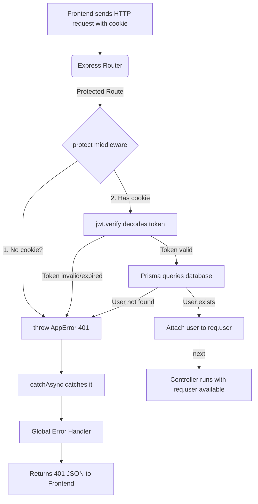

# Detailed Breakdown: `server/middleware/auth.ts`

## 1. Overview & Importance
This file acts as the "Bouncer" for our secure API routes. Any route that requires the user to be logged in (like creating a task or sending a message) will pass through this middleware first.

**What problem it solves:**
In the original broken project, the frontend stored the user's ID in `localStorage` and sent it manually with every request. This is highly insecure because hackers can easily edit `localStorage` to impersonate anyone. We solve this by using **HttpOnly Cookies** and **JSON Web Tokens (JWTs)**. The server signs a mathematical token that cannot be forged. This middleware reads the cookie, validates the math, and attaches the verified user to the request.

**Alternatives Considered:**
*   **Passport.js:** A popular authentication middleware with hundreds of "strategies." Rejected because it is notoriously complex to configure and adds unnecessary abstraction. Writing a custom JWT flow teaches you the underlying mechanics.
*   **Session-based auth (express-session + Redis):** Stores login state on the server. Rejected because it doesn't scale well across multiple servers without a Redis store, and JWTs are stateless by design.

---

## 2. Line-by-Line Breakdown

```typescript
import { AppError } from "../utils/AppError";
import { catchAsync } from "../utils/catchAsync";
```
*   **Why we used it:** Instead of using ugly `try/catch` blocks and manual `res.status().json()` calls, we now use our professional error infrastructure. `catchAsync` wraps the whole function, and `AppError` lets us throw clean errors with specific HTTP status codes.

```typescript
declare global {
  namespace Express {
    interface Request {
      user?: any;
    }
  }
}
```
*   **Why we used it:** By default, Express's `Request` object does not have a `.user` property. This TypeScript declaration tells the compiler: *"We are going to attach a user object to the request later, so don't throw a type error when we do."* The `?` means it's optional (because unauthenticated requests won't have it).

```typescript
export const protect = catchAsync(async (req: Request, res: Response, next: NextFunction) => {
```
*   **Why we used it:** We wrap the entire async function in `catchAsync`. This is the key upgrade from our old version. If *any* line inside this function throws an error (like `jwt.verify` failing on a tampered token), `catchAsync` automatically catches the rejected Promise and passes it to the Global Error Handler. **Zero `try/catch` blocks needed.**

```typescript
  const token = req.cookies.jwt;
```
*   **Why we used it:** We use `req.cookies` (made possible by the `cookie-parser` middleware in `index.ts`) to grab the JWT token. Because we set the cookie as `httpOnly` when the user logged in, JavaScript running in the browser **cannot** read or steal this cookie. This makes our authentication immune to XSS (Cross-Site Scripting) attacks.

```typescript
  if (!token) {
    throw new AppError('Not authorized, no token provided', 401);
  }
```
*   **Why we used it:** If there is no cookie at all (the user never logged in, or the cookie expired), we throw an `AppError` with status `401` (Unauthorized). Because we are inside `catchAsync`, this error is automatically caught and forwarded to the Global Error Handler, which formats it into a clean JSON response for the React frontend.

```typescript
  const decoded = jwt.verify(token, process.env.JWT_SECRET!) as { userId: string };
```
*   **Why we used it:** This is the mathematical verification step. `jwt.verify` takes the token and the secret key from our `.env` file. If the token was created by our server and hasn't expired, it decodes it and gives us back the `userId` we embedded inside it during login. If a hacker tampered with even a single character of the token, this function **instantly throws an error**, which `catchAsync` catches automatically.
*   **The `!` after `JWT_SECRET`:** This is a TypeScript "non-null assertion." It tells the compiler: *"I guarantee this environment variable exists, trust me."*

```typescript
  const user = await prisma.user.findUnique({
    where: { id: decoded.userId },
    select: { id: true, name: true, email: true, role: true, avatar: true },
  });
```
*   **Why we used it:** Even though the token is valid, we still query the database to confirm the user still exists. What if an admin deleted their account while they were logged in? Without this check, the deleted user could keep making requests with their old token.
*   **The `select` block is critical:** Notice we specifically pick only `id`, `name`, `email`, `role`, and `avatar`. We deliberately **do NOT** select `passwordHash`. This is a security best practice—password hashes should never be floating around in memory or attached to request objects.

```typescript
  if (!user) {
    throw new AppError('Not authorized, user no longer exists', 401);
  }
```
*   **Why we used it:** If the database query returns `null` (user was deleted), we throw a clean 401 error using our `AppError` class.

```typescript
  req.user = user;
  next();
});
```
*   **Why we used it:** `req.user = user` attaches the verified user data to the request object. Now, any controller function that runs after this middleware can easily access `req.user.id` or `req.user.role` without having to query the database again. `next()` is Express's way of saying: *"The Bouncer has approved this person. Pass them on to the actual API route handler."*

---

## 3. Data Flow



---

## 4. How it links to other files
*   **From `server/index.ts`:** The `cookie-parser` middleware configured there is what makes `req.cookies.jwt` available to us.
*   **From `server/utils/catchAsync.ts`:** Wraps this entire function, eliminating `try/catch` blocks.
*   **From `server/utils/AppError.ts`:** Provides the custom error class with HTTP status codes.
*   **From `server/lib/prisma.ts`:** Provides the database client singleton to query the User table.
*   **To `server/routes/*.ts`:** Every protected route will use this middleware like: `router.get('/tasks', protect, getTasksController)`.
*   **To `server/controllers/*.ts`:** After this middleware runs, controllers can safely access `req.user.id` to know exactly who is making the request.
