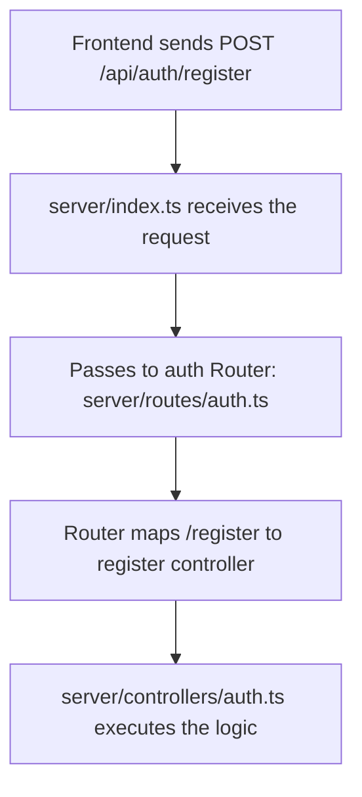

# Detailed Breakdown: `server/routes/auth.ts`

## 1. Overview & Importance
This file is the **Router** layer in our MVC architecture. It is the simplest file in the authentication system. Its only job is to map incoming URL paths to the correct Controller function.

**What problem it solves:**
Without a router, Express would not know what to do when a user visits `POST /api/auth/register`. The router acts as a traffic cop: it says *"If someone hits this URL with this HTTP method, run this specific controller function."* By keeping routing separate from business logic, we can instantly see every URL our API supports by glancing at one small file.

**Alternatives Considered:**
*   **Defining routes directly in `index.ts`:** Rejected because it makes the entry point file bloated and hard to maintain. As the app grows, having 50+ routes in one file becomes unmanageable.

---

## 2. Line-by-Line Breakdown

```typescript
import { Router } from 'express';
```
*   **Why we used it:** Express provides a `Router` class that lets us create modular, mountable route handlers. We create a mini-app that handles only auth-related URLs, then plug it into the main `index.ts`.

```typescript
import { register, login, logout } from '../controllers/auth';
```
*   **Why we used it:** We import the three controller functions we just wrote. The router doesn't contain any logic — it just points URLs to these functions.

```typescript
router.post('/register', register);
router.post('/login', login);
router.post('/logout', logout);
```
*   **Why we used it:** Each line maps an HTTP method + URL path to a controller. When someone sends a `POST` request to `/api/auth/register`, Express will execute the `register` function from our controller.
*   **Why POST and not GET?** `POST` is used because we are sending sensitive data (passwords) in the request body. `GET` requests put data in the URL, which gets logged in browser history and server logs — a massive security risk.

---

## 3. Data Flow



---

## 4. How it links to other files
*   **From `server/controllers/auth.ts`:** Imports the `register`, `login`, and `logout` functions.
*   **To `server/index.ts`:** This router is imported and mounted with `app.use('/api/auth', authRoutes)`. The `/api/auth` prefix is added in `index.ts`, which is why the router only defines `/register`, `/login`, and `/logout` (not `/api/auth/register`).
