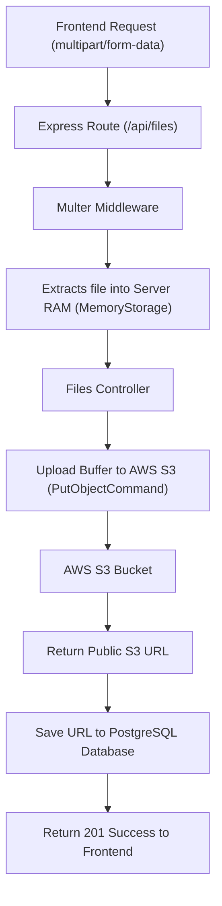

# Detailed Breakdown: AWS S3 File Uploads Architecture

## 1. Overview & Importance
Implementing file uploads is one of the most common requirements in modern web apps, but it's also one of the easiest to get wrong. 

**What beginners do:**
Beginners use `multer` to save uploaded files directly to their server's hard drive (e.g., a `/public/uploads` folder). This works locally, but **fails in production**. Modern deployment platforms (like Vercel, Heroku, or AWS ECS) use "ephemeral storage." Every time you deploy or the server restarts, the hard drive is wiped clean. All user files get deleted!

**The Enterprise Solution (What we are doing):**
We are using AWS S3 (Simple Storage Service). When a user uploads a file:
1.  **Multer** intercepts the file and holds it temporarily in the server's RAM (Memory Storage).
2.  Our **Controller** takes that buffer from RAM and streams it directly to the AWS S3 Bucket.
3.  AWS sends back a permanent public URL (e.g., `https://team-task-manager.s3.amazonaws.com/image.png`).
4.  We save that URL to our PostgreSQL database via **Prisma**.

This ensures files are safe, infinitely scalable, and served blazing fast by AWS.

---

## 2. Line-by-Line Breakdown: `server/lib/s3.ts`

```typescript
import { S3Client } from '@aws-sdk/client-s3';
```
*   **Why we used it:** We use the official AWS SDK v3. Unlike v2, v3 is modular, meaning we only import the S3 parts, keeping our server lightweight.

```typescript
export const s3 = new S3Client({
  region: process.env.AWS_REGION!,
  credentials: {
    accessKeyId: process.env.AWS_ACCESS_KEY_ID!,
    secretAccessKey: process.env.AWS_SECRET_ACCESS_KEY!,
  },
});
```
*   **Why we used it:** This initializes our connection to AWS. The `!` tells TypeScript "Don't worry, I guarantee these environment variables exist in our `.env` file."

---

## 3. Line-by-Line Breakdown: `server/middleware/upload.ts`

```typescript
import multer from 'multer';
const storage = multer.memoryStorage();
```
*   **Why we used it:** Multer parses `multipart/form-data` (the encoding used for file uploads). `memoryStorage()` is critical here. It tells Multer *not* to write to the hard drive, but to keep the file as a `Buffer` in RAM so we can immediately shoot it over to AWS.

```typescript
export const upload = multer({
  storage,
  limits: {
    fileSize: 5 * 1024 * 1024, // 5 MB
  },
});
```
*   **Why we used it:** **Security Upgrade**. Without a size limit, a malicious user could upload a 50GB dummy file, which would instantly crash our server's RAM (Out of Memory error). Limiting it to 5MB protects our server health.

---

## 4. Data Flow


