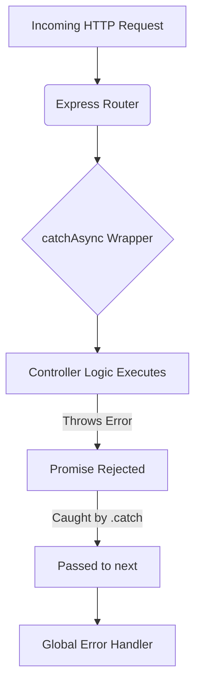

# Detailed Breakdown: `server/utils/catchAsync.ts`

## 1. Overview & Importance
This is a highly advanced, "Pro" utility function. It acts as a wrapper around our asynchronous Express route controllers.

**What problem it solves:**
Express.js does not automatically catch errors thrown inside `async` functions. If an async function throws an error (e.g., the database connection times out), the request hangs forever and the user just sees a spinning loading wheel. The traditional fix is to wrap every route in a `try/catch` block. `catchAsync` solves this by automatically catching any rejected promises and passing them to Express's `next()` function, **completely eliminating the need for `try/catch` blocks in our controllers.**

**Alternatives Considered:**
*   **Using `try/catch` everywhere:** Rejected because it drastically increases the size of our controller files and makes business logic hard to read.
*   **`express-async-handler` (npm package):** We could have downloaded an external library to do this. Rejected because writing it ourselves is only 5 lines of code, reduces our dependency bloat, and proves we understand how higher-order functions work.

---

## 2. Line-by-Line Breakdown

```typescript
import { Request, Response, NextFunction } from 'express';
```
*   **Why we used it:** We import the types from Express so TypeScript knows what `req`, `res`, and `next` are.

```typescript
export const catchAsync = (fn: Function) => {
```
*   **Why we used it:** This is a "Higher-Order Function"—a function that takes another function (`fn`) as an argument. In our case, `fn` will be our Controller logic.

```typescript
  return (req: Request, res: Response, next: NextFunction) => {
```
*   **Why we used it:** It returns a brand new Express middleware function. This new function is what actually gets executed when a user hits a URL.

```typescript
    fn(req, res, next).catch(next);
  };
};
```
*   **Why we used it:** This is the magic line. It executes our controller (`fn`). Because our controller is an `async` function, it returns a Promise. If that Promise fails (throws an error), `.catch(next)` instantly intercepts the error and passes it directly to our Global Error Handler.

---

## 3. Data Flow



---

## 4. How it links to other files
*   **To `server/routes/*.ts`:** Every route definition will wrap its controller with this function. (e.g., `router.post('/login', catchAsync(loginController))`).
*   **To `server/middleware/errorHandler.ts`:** When `catch(next)` fires, it sends the error straight to the global error handler.
