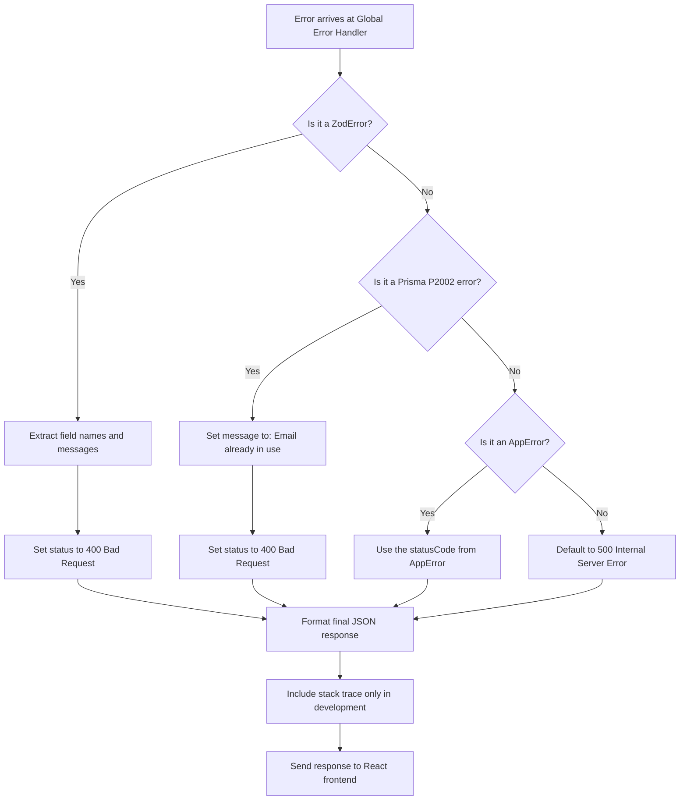

# Detailed Breakdown: `server/middleware/errorHandler.ts`

## 1. Overview & Importance
This file is the ultimate "Safety Net" for our backend application. It is a specialized piece of Express middleware that sits at the very end of our application pipeline.

**What problem it solves:**
If a database query fails or a user inputs bad data, Express defaults to crashing the server or sending a massive, ugly HTML page containing a stack trace back to the browser. This is a huge security vulnerability as it reveals our code structure to hackers. The Global Error Handler catches *all* errors, suppresses the stack trace in production environments, and ensures the React frontend always receives a clean, predictable JSON response.

**Alternatives Considered:**
*   **Handling errors per-route:** Rejected because it violates the DRY (Don't Repeat Yourself) principle. If we wanted to change how errors were formatted, we would have to edit 50 different files.

---

## 2. Line-by-Line Breakdown

```typescript
import { ZodError } from "zod";
```
*   **Why we used it:** We import the `ZodError` class directly from Zod. This allows us to use `instanceof` to detect whether an error was thrown by Zod validation, so we can format it differently from other errors.

```typescript
export const errorHandler = (err: any, req: Request, res: Response, next: NextFunction): void => {
```
*   **Why we used it:** Notice that this function takes **four** arguments instead of three. In Express, any middleware that takes exactly four arguments (`err, req, res, next`) is automatically recognized as an Error Handling Middleware. Express will skip this middleware during normal requests and only call it when an error is passed via `next(error)` or thrown inside `catchAsync`.

```typescript
  let statusCode = err.statusCode || 500;
  let message = err.message || 'Internal Server Error';
```
*   **Why we used it:** If the error is an `AppError` we threw manually, it will have a `statusCode` (like 404). If it's an unexpected crash (like a missing variable), it won't have a code, so we default to `500` (Internal Server Error).

```typescript
  if (err instanceof ZodError) {
    statusCode = 400;
    const errors = err.issues.map((e) => `${e.path.join('.')}: ${e.message}`);
    message = errors.join(', ');
  }
```
*   **Why we used it:** This is the key upgrade. When Zod validation fails, it throws a `ZodError` containing an array of detailed error objects. Raw, this looks like an unreadable JSON blob. We use `.map()` to extract just the field name (`e.path`) and the human-readable message (`e.message`), then join them with commas. The result is a clean string like: `"name: Name must be at least 2 characters, email: Invalid email address"`.

```typescript
  if (err.code === 'P2002') {
    statusCode = 400;
    message = 'This email is already in use.';
  }
```
*   **Why we used it:** Prisma throws specific error codes (like `P2002` for Unique Constraint Violations). Instead of crashing, we intercept Prisma's raw database error and translate it into a human-readable message for the frontend user.

```typescript
  res.status(statusCode).json({
    status: 'error',
    message,
    stack: process.env.NODE_ENV === 'development' ? err.stack : undefined,
  });
```
*   **Why we used it:** Finally, we send the formatted JSON response back. We explicitly check `NODE_ENV`. If we are coding locally (`development`), we include the full `err.stack` so we can debug our code. If we are deployed in production, the stack trace is hidden from hackers.

---

## 3. Error Type Detection Flow



---

## 4. How it links to other files
*   **From `server/index.ts`:** This middleware is mounted at the absolute bottom of `index.ts`, directly above `app.listen()`. It must be last so it can catch errors from everything above it.
*   **From `server/utils/AppError.ts`:** It reads the `statusCode` property attached to errors by the `AppError` class.
*   **From `server/utils/catchAsync.ts`:** When `catchAsync` catches a rejected Promise, it calls `next(error)`, which funnels the error directly into this handler.
*   **From `server/schemas/index.ts`:** When Zod's `.parse()` method fails, it throws a `ZodError` that this handler now formats cleanly.
