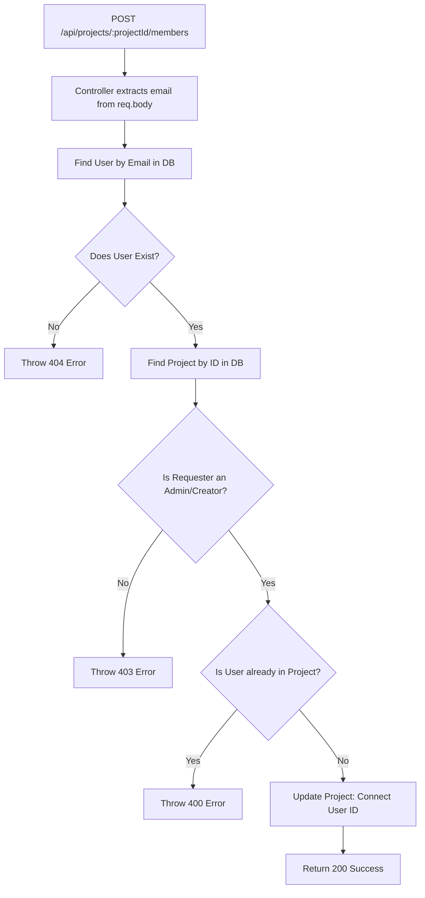

# Detailed Breakdown: `server/controllers/members.ts`

## 1. Overview & Importance
This controller handles the "Team" part of the Team Task Manager. It allows users to invite others to their projects and manage their team roster. 

**What problem it solves:**
Without this controller, every project is a silo containing only one person. By manipulating the many-to-many relationship (`members` array) between `User` and `Project` in our Prisma schema, we allow multiple people to collaborate, which unlocks the functionality of the Tasks and Files controllers we built earlier.

**Pro Upgrades Implemented:**
1.  **Email-Based Invites:** Instead of asking a user to type in a complicated `userId` (UUID), we let them invite people via email. The backend handles looking up the user by email and connecting their ID silently.
2.  **Idempotency & Safe Failures:** If you try to add someone who is *already* in the project, the system doesn't crash—it throws a clean 400 error. If you invite an email that isn't registered yet, it throws a clean 404 error.
3.  **Strict Role-Based Access Control (RBAC):** We enforce that *only* the Project Creator (or an ADMIN) can add or remove members. Normal members cannot secretly invite their friends into a private project.

---

## 2. Line-by-Line Breakdown

### Add Member
```typescript
const userToAdd = await prisma.user.findUnique({
    where: { email: validatedData.email }
});

if (!userToAdd) {
    throw new AppError('No user found with this email address.', 404);
}
```
*   **Why we used it:** We do an email lookup. If the user hasn't registered an account on our app yet, we cannot add them to the project. (In a massive enterprise app, you might send them a "Join our app!" email instead, but for now, we just reject the request).

```typescript
const isAlreadyMember = project.members.some(m => m.id === userToAdd.id);
if (isAlreadyMember) {
    throw new AppError('This user is already a member of the project.', 400);
}
```
*   **Why we used it:** This prevents Prisma from throwing a messy database constraint error if we try to connect someone who is already connected.

```typescript
await prisma.project.update({
    where: { id: req.params.projectId },
    data: {
        members: {
            connect: { id: userToAdd.id }
        }
    }
});
```
*   **Why we used it:** This is the magic of Prisma's relational API. We don't have to write a complex SQL `INSERT INTO ProjectMembers (projectId, userId)` query. We just tell Prisma to `connect` the user to the `members` array, and Prisma handles the intermediate pivot tables automatically.

### Remove Member
```typescript
if (req.params.userId === req.user.id) {
    throw new AppError('You cannot remove yourself. Use the leave project feature instead.', 400);
}
```
*   **Why we used it:** We prevent the project manager from accidentally clicking "Remove" on themselves, which would instantly lock them out of their own project!

```typescript
await prisma.project.update({
    where: { id: req.params.projectId },
    data: {
        members: {
            disconnect: { id: req.params.userId }
        }
    }
});
```
*   **Why we used it:** The exact opposite of `connect`. `disconnect` removes the relationship between the User and the Project without actually deleting the User's account or the Project itself.

---

## 3. Data Flow (Adding a Member)


