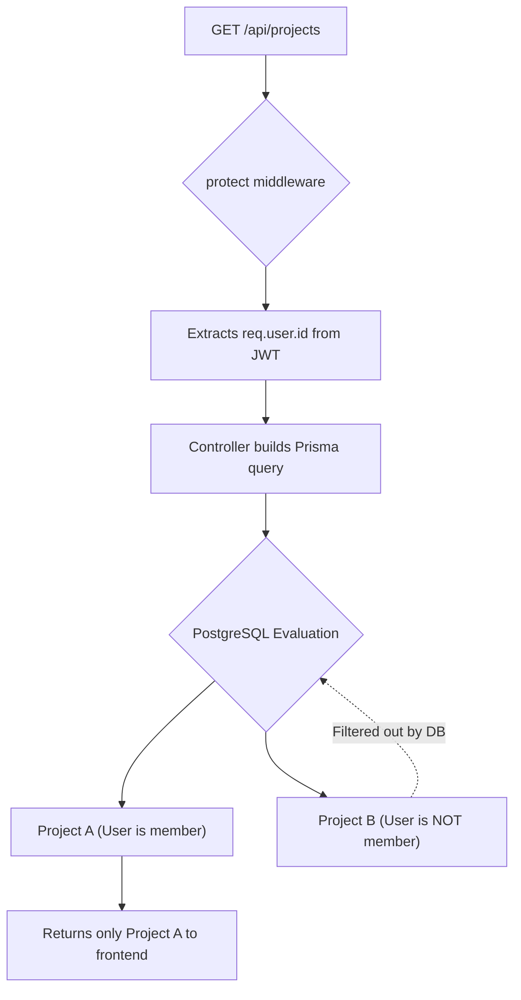

# Detailed Breakdown: `server/controllers/projects.ts`

## 1. Overview & Importance
This controller manages the core organizational unit of our application: **Projects**. It implements the standard CRUD operations (Create, Read, Update, Delete) but with a critical security layer.

**What problem it solves:**
In a standard tutorial app, `getProjects` would simply run `SELECT * FROM Projects` and return everything to anyone. In a production app (just like the tenant isolation in your MedLayer project), users must be physically restricted from seeing data they don't own. This controller implements **Data Isolation** at the ORM layer — ensuring users only see projects they are explicitly a member of.

**Pro Upgrades Implemented:**
1.  **Implicit Relationship Mapping:** When creating a project, we don't just insert a row. We use Prisma's `connect` API to instantly bind the logged-in user to the project's `members` array in a single transaction.
2.  **UX vs. Security (404 vs 403):** When fetching, updating, or deleting a specific project by ID, we purposefully split our error checking into two steps. First, we check if the project exists (returning 404 if not). Then, we check if the user is a member (returning 403 Forbidden if not). This provides a superior UX over combining them into a single 404 error, and because we use UUIDs, we are still safe from ID Enumeration attacks.
3.  **Aggregation (`_count`):** When listing projects, we don't just return the name. We use Prisma's `_count` feature to return the total number of tasks and members inside each project, which is perfect for dashboard UI cards.

---

## 2. Line-by-Line Breakdown

### Create Project
```typescript
const project = await prisma.project.create({
  data: {
    ...validatedData,
    members: {
      connect: { id: req.user.id }
    }
  }
});
```
*   **Why we used it:** We spread the `validatedData` (name, description) into the data object. The magic is the `members: { connect: ... }` block. Because our schema defines a many-to-many relationship between Users and Projects, this tells Prisma: *"Create this project, and immediately add the user making the request to the members pivot table."*

### Get All Projects (For the Logged-in User)
```typescript
const projects = await prisma.project.findMany({
  where: {
    members: {
      some: { id: req.user.id }
    }
  },
```
*   **Why we used it:** This is the equivalent of your `baseTenantService` from MedLayer. We filter the entire Projects table, demanding that the `members` array must contain *at least some* user whose ID matches `req.user.id`.

```typescript
  include: {
    _count: {
      select: { tasks: true, members: true }
    }
  }
});
```
*   **Why we used it:** Instead of fetching all the task objects and counting them in JavaScript (which is slow and uses too much RAM), we tell PostgreSQL to count the relationships at the database level.

### Get Single Project
```typescript
const project = await prisma.project.findUnique({
  where: { id: req.params.id },
  include: { ... }
});

if (!project) throw new AppError('Project not found', 404);

const isMember = project.members.some(member => member.id === req.user.id);
if (!isMember) throw new AppError('You do not have access to this project', 403);
```
*   **Why we used it:** We use `findUnique` to grab the project. If it's missing, we throw a 404. If it exists, we run a JavaScript `.some()` array method to check if the currently logged-in user is inside the `members` array. If not, we explicitly throw a 403 Forbidden error. This is the UX vs Security separation discussed above.

### Update and Delete Project
```typescript
const existingProject = await prisma.project.findUnique({
  where: { id: req.params.id },
  include: { members: { select: { id: true } } }
});
```
*   **Why we used it:** Before running an `update` or `delete` query, we MUST verify the project exists and the user has permission. Notice we use `select: { id: true }` inside the `include`. This is an optimization trick! Because we only need to check if `req.user.id` is in the members array, we tell Postgres to ONLY return the `id` column of the members, saving memory and bandwidth.

```typescript
if (req.user.role !== 'ADMIN') {
  throw new AppError('Only administrators can delete projects', 403);
}
```
*   **Why we used it (Delete only):** We enforce Role-Based Access Control (RBAC). Even if a user is a member of a project, they cannot delete it unless their global role is `ADMIN`.

---

## 3. Data Flow (Data Isolation)



---

## 4. How it links to other files
*   **From `server/schemas/index.ts`:** Imports `createProjectSchema` and `updateProjectSchema`.
*   **From `server/utils/catchAsync.ts`:** Wraps all functions so any database errors are funneled to the global handler.
*   **To `server/routes/projects.ts` (upcoming):** These controller functions will be bound to the `/api/projects` endpoints.
