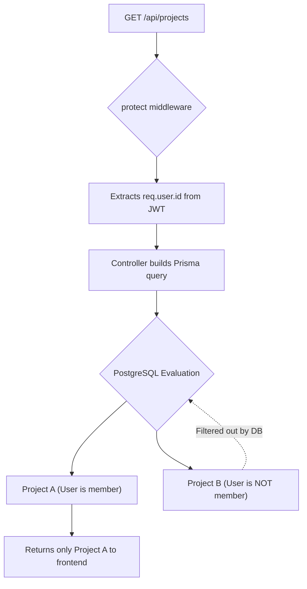

# Detailed Breakdown: `server/controllers/projects.ts`

## 1. Overview & Importance
This controller manages the core organizational unit of our application: **Projects**. It implements the standard CRUD operations (Create, Read, Update, Delete) but with a critical security layer.

**What problem it solves:**
In a standard tutorial app, `getProjects` would simply run `SELECT * FROM Projects` and return everything to anyone. In a production app (just like the tenant isolation in your MedLayer project), users must be physically restricted from seeing data they don't own. This controller implements **Data Isolation** at the ORM layer — ensuring users only see projects they are explicitly a member of.

**Pro Upgrades Implemented:**
1.  **Implicit Relationship Mapping:** When creating a project, we don't just insert a row. We use Prisma's `connect` API to instantly bind the logged-in user to the project's `members` array in a single transaction.
2.  **Access Control via Queries:** Instead of fetching a project by ID and *then* writing an `if` statement to check if the user is a member, we embed the authorization check directly inside the database query. If they aren't a member, the database acts like the project doesn't even exist (returning 404). This prevents ID-guessing attacks (Insecure Direct Object Reference).
3.  **Aggregation (`_count`):** When listing projects, we don't just return the name. We use Prisma's `_count` feature to return the total number of tasks and members inside each project, which is perfect for dashboard UI cards.

---

## 2. Line-by-Line Breakdown

### Create Project
```typescript
const project = await prisma.project.create({
  data: {
    ...validatedData,
    members: {
      connect: { id: req.user.id }
    }
  }
});
```
*   **Why we used it:** We spread the `validatedData` (name, description) into the data object. The magic is the `members: { connect: ... }` block. Because our schema defines a many-to-many relationship between Users and Projects, this tells Prisma: *"Create this project, and immediately add the user making the request to the members pivot table."*

### Get All Projects (For the Logged-in User)
```typescript
const projects = await prisma.project.findMany({
  where: {
    members: {
      some: { id: req.user.id }
    }
  },
```
*   **Why we used it:** This is the equivalent of your `baseTenantService` from MedLayer. We filter the entire Projects table, demanding that the `members` array must contain *at least some* user whose ID matches `req.user.id`.

```typescript
  include: {
    _count: {
      select: { tasks: true, members: true }
    }
  }
});
```
*   **Why we used it:** Instead of fetching all the task objects and counting them in JavaScript (which is slow and uses too much RAM), we tell PostgreSQL to count the relationships at the database level.

### Get Single Project
```typescript
const project = await prisma.project.findFirst({
  where: {
    id: req.params.id,
    members: { some: { id: req.user.id } }
  },
```
*   **Why we used it:** We use `findFirst` instead of `findUnique` because we are combining two filters: the project ID *and* the membership check. If a user tries to access `GET /api/projects/123` but they are not in the `members` array, Prisma returns `null` and we throw a 404 error.

```typescript
  include: {
    members: { select: { id: true, name: true, avatar: true } },
    tasks: { orderBy: { createdAt: 'desc' } }
  }
});
```
*   **Why we used it:** When viewing a specific project, the React frontend needs to display who is in it and what the tasks are. `include` runs the SQL JOINs automatically. Notice we use `select` inside the `members` include — we NEVER want to accidentally send password hashes to the frontend!

---

## 3. Data Flow (Data Isolation)



---

## 4. How it links to other files
*   **From `server/schemas/index.ts`:** Imports `createProjectSchema` and `updateProjectSchema`.
*   **From `server/utils/catchAsync.ts`:** Wraps all functions so any database errors are funneled to the global handler.
*   **To `server/routes/projects.ts` (upcoming):** These controller functions will be bound to the `/api/projects` endpoints.
