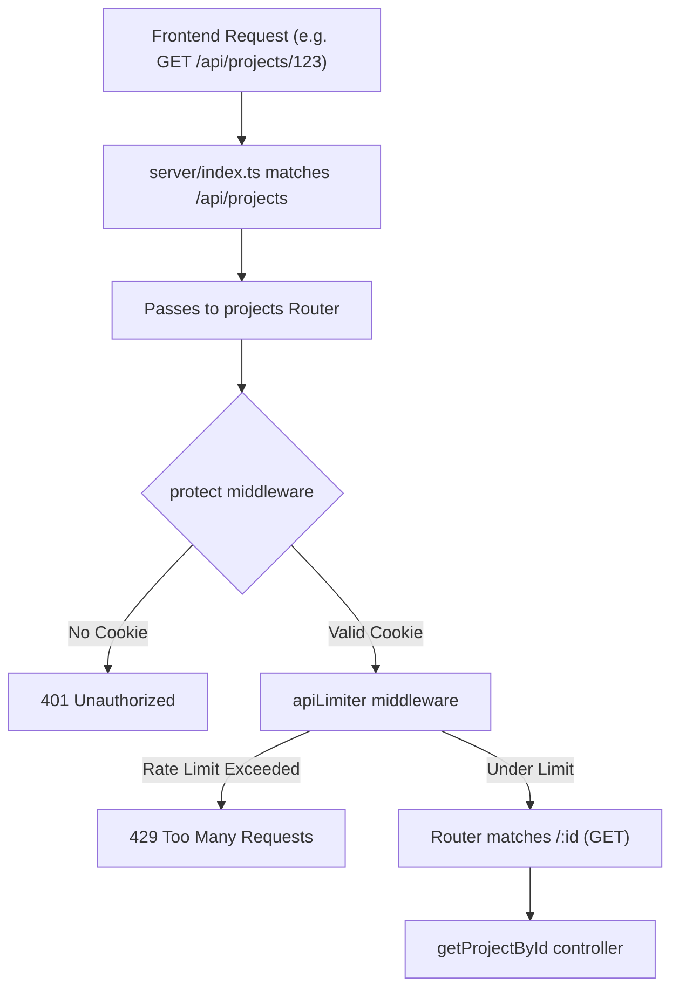

# Detailed Breakdown: `server/routes/projects.ts`

## 1. Overview & Importance
This file is the **Router** layer for Projects. It maps URLs (like `POST /api/projects`) to the business logic inside our `projects.ts` controller. 

**What problem it solves:**
By keeping the routing separate from the controller logic, we maintain a clean architecture. You can instantly see all the capabilities of the Projects feature just by looking at this 15-line file. 

**Pro Upgrades Implemented:**
1.  **Global Route Protection:** Instead of adding the `protect` middleware to every single route individually, we use `router.use(protect)` at the very top. This guarantees that *every* project route requires a valid JWT cookie. If we ever add a new route and forget to protect it, this acts as a foolproof safety net.
2.  **Tiered Rate Limiting:** We apply the `apiLimiter` (100 requests / 15 minutes) to these routes. This prevents abusive users from spamming the database with requests, without being as restrictive as the auth routes.

---

## 2. Line-by-Line Breakdown

```typescript
import { Router } from 'express';
import { createProject, getProjects, getProjectById, updateProject, deleteProject } from '../controllers/projects';
import { protect } from '../middleware/auth';
import { apiLimiter } from '../middleware/rateLimiter';
```
*   **Why we used it:** Imports our controller functions, the JWT authentication middleware (`protect`), and the relaxed API rate limiter.

```typescript
const router = Router();
```
*   **Why we used it:** Creates an isolated Express mini-application just for project routes.

```typescript
router.use(protect);
router.use(apiLimiter);
```
*   **Why we used it:** This is a huge Developer Experience (DX) win. By calling `router.use()` with these middlewares *before* defining the routes, Express will automatically run `protect` and `apiLimiter` for every route in this file. It keeps the route definitions clean and eliminates human error (forgetting to protect a route).

```typescript
router.route('/')
  .post(createProject)
  .get(getProjects);
```
*   **Why we used it:** `router.route()` lets us chain multiple HTTP methods onto the exact same URL path. `POST /` triggers `createProject`, while `GET /` triggers `getProjects`. This is cleaner than writing `router.post('/')` and `router.get('/')` separately.

```typescript
router.route('/:id')
  .get(getProjectById)
  .patch(updateProject)
  .delete(deleteProject);
```
*   **Why we used it:** The `/:id` is a dynamic URL parameter (e.g., `/api/projects/123`). Express extracts `123` and puts it in `req.params.id` for our controller to use. 
*   **Why `patch` instead of `put`?** `PUT` implies replacing the *entire* resource (if you don't send a description, it gets deleted). `PATCH` implies a *partial* update (if you only send a name, only the name changes). Since our Zod schema uses `.optional()`, we are doing partial updates, making `PATCH` the semantically correct HTTP method.

---

## 3. Data Flow


