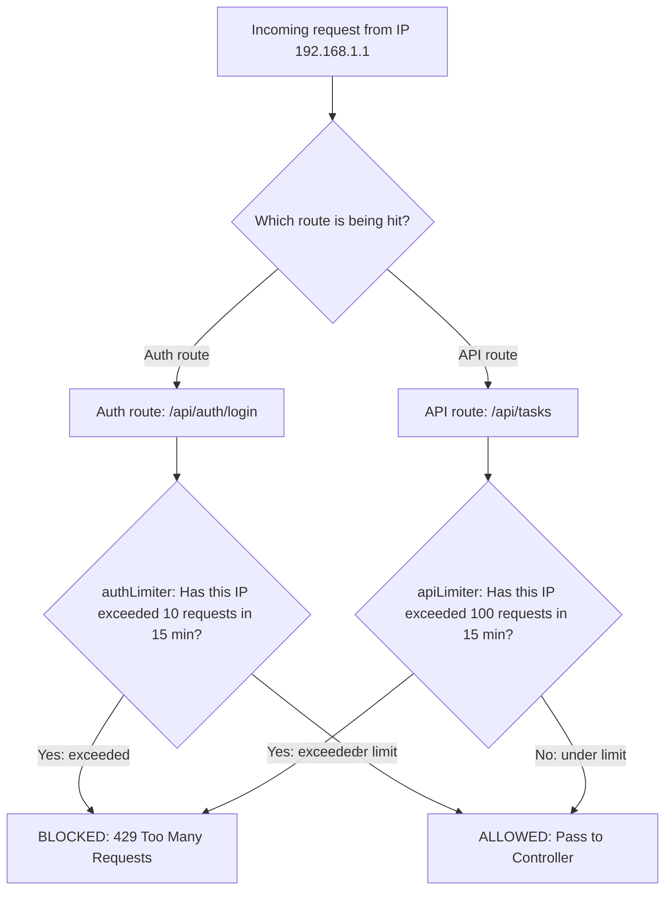

# Detailed Breakdown: `server/middleware/rateLimiter.ts`

## 1. Overview & Importance
This file implements **Tiered Rate Limiting** — a technique used by companies like Stripe, GitHub, and AWS to protect their APIs from abuse.

**What problem it solves:**
Without rate limiting, a hacker can write a script that sends 10,000 login attempts per second to your `/api/auth/login` route, trying every common password until one works (a "Brute-Force Attack"). Rate limiting tells Express: *"If this IP address sends more than X requests in Y minutes, block them."*

**Why "Tiered" is a Pro upgrade:**
Most beginners apply a single, blanket rate limiter to the entire app. This is problematic because login routes need extremely strict limits (10 attempts/15min), but dashboard data routes need relaxed limits (100 requests/15min) to allow normal usage. By creating separate `authLimiter` and `apiLimiter` instances, we apply surgical protection where it's needed most.

**Alternatives Considered:**
*   **Single global rate limiter:** Rejected because it either over-restricts normal API usage or under-protects sensitive auth routes.
*   **Redis-backed rate limiting (`rate-limit-redis`):** The enterprise approach for distributed systems with multiple servers. Not needed for our single-server setup, but easy to swap in later.
*   **Cloudflare / AWS WAF:** Network-level rate limiting. Rejected because we want application-level control and this is a learning project.

---

## 2. Line-by-Line Breakdown

```typescript
import rateLimit from 'express-rate-limit';
```
*   **Why we used it:** Imports the `express-rate-limit` library which provides a clean, configurable middleware factory.

```typescript
export const authLimiter = rateLimit({
  windowMs: 15 * 60 * 1000,
  max: 10,
```
*   **Why we used it:** Creates a strict limiter specifically for authentication routes. `windowMs` defines the time window (15 minutes in milliseconds). `max: 10` means a single IP address can only attempt to login or register 10 times within that 15-minute window. After that, every request from that IP gets instantly blocked with a 429 status code.

```typescript
  message: { status: 'error', message: 'Too many attempts. Please try again after 15 minutes.' },
```
*   **Why we used it:** When the limit is hit, instead of returning a generic error, we return a JSON object that matches our standard error format (with `status` and `message`). This allows our React frontend to display a clean user-facing message.

```typescript
  standardHeaders: true,
  legacyHeaders: false,
```
*   **Why we used it:** `standardHeaders: true` tells the middleware to include `RateLimit-Limit`, `RateLimit-Remaining`, and `RateLimit-Reset` headers in every response. This is a professional API practice — it lets the frontend (or any API consumer) know exactly how many requests they have left before being blocked. `legacyHeaders: false` disables the older `X-RateLimit-*` format.

```typescript
export const apiLimiter = rateLimit({
  windowMs: 15 * 60 * 1000,
  max: 100,
```
*   **Why we used it:** A relaxed limiter for general API routes (fetching tasks, loading dashboards). 100 requests per 15 minutes is generous enough for normal usage but still prevents abuse.

---

## 3. Data Flow



---

## 4. How it links to other files
*   **To `server/routes/auth.ts`:** The `authLimiter` is applied as middleware specifically on the `/register` and `/login` routes.
*   **To `server/routes/tasks.ts` (future):** The `apiLimiter` will be applied to general data routes.
*   **To `server/index.ts`:** Alternatively, `apiLimiter` can be mounted globally with `app.use('/api', apiLimiter)` to protect all routes at once.
