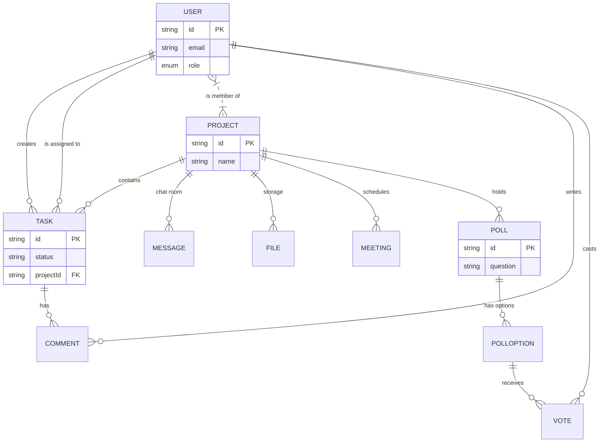

# Detailed Breakdown: `schema.prisma`

## 1. Overview & Importance
The `schema.prisma` file is the absolute core of our backend architecture. It acts as the "Single Source of Truth" for our database. 

**What problem it solves:**
Historically, developers had to write raw SQL tables, and then manually create TypeScript `Interfaces` that matched those tables. If the database changed, the TypeScript types often didn't, leading to silent crashes in production. Prisma solves this by combining them. You write this single file, and Prisma automatically generates both your PostgreSQL database tables AND your fully-typed Node.js client (`@prisma/client`).

**Alternatives Considered:**
*   **Raw SQL + `pg` driver:** Maximum performance, but no type safety, slow developer velocity, and prone to SQL injection if not careful. Rejected.
*   **TypeORM / Sequelize:** Older ORMs that rely on complex JavaScript classes and decorators. Often have "N+1" query performance issues and less accurate TypeScript typing. Rejected.
*   **Mongoose (MongoDB):** A NoSQL alternative. Rejected because Task Management systems inherently have heavily relational data (Users belong to Projects, Tasks belong to Projects and Users). Relational databases (PostgreSQL) are much better for this.

---

## 2. Global Configurations

```prisma
generator client {
  provider = "prisma-client-js"
}

datasource db {
  provider = "postgresql"
  url      = env("DATABASE_URL")
}
```
*   **`generator client`:** Tells Prisma what to do when we run `npx prisma generate`. In this case, we tell it to build a JavaScript/TypeScript client that we will import into our Express server (`server/index.ts`).
*   **`datasource db`:** Defines where the data lives. We set the provider to `"postgresql"` (AWS RDS) and pull the connection string from the `.env` file so our password isn't hardcoded in the codebase.

---

## 3. Enums (Type Safety at the Database Level)

```prisma
enum Role { ADMIN  MEMBER }
enum TaskStatus { TODO  IN_PROGRESS  REVIEW  COMPLETED }
// ... (other enums)
```
*   **Why we use it:** Instead of using standard `String` columns which allow typos (e.g., `"Pnding"` instead of `"PENDING"`), `enum` forces the database to reject invalid data.
*   **Data Flow:** When a user sends a POST request to `server/routes/tasks.ts` to update a task status, Prisma will validate the string against this enum before even talking to the database.

---

## 4. Models & Relational Architecture

### The User Model
```prisma
model User {
  id            String    @id @default(uuid())
  name          String
  email         String    @unique
  passwordHash  String
  role          Role      @default(MEMBER)
  avatar        String?   // S3 URL
//...
```
*   **`@id @default(uuid())`:** We use UUIDs (Universally Unique Identifiers) instead of auto-incrementing integers (`1, 2, 3`). **Why?** Integers are easily guessable by hackers (e.g., `api/users/5`). UUIDs prevent ID-guessing attacks.
*   **`@unique`:** Ensures no two users can register with the same email. The database enforces this, saving us from writing custom validation logic.
*   **`avatar`:** Notice this is a `String?` (the `?` means optional). In the original code, avatars were stored as heavy Base64 strings inside the database. Here, it will just store a short `https://` URL pointing to our AWS S3 bucket.

### Foreign Keys & Cascading Deletes
```prisma
model Task {
  // ...
  projectId   String
  project     Project      @relation(fields: [projectId], references: [id], onDelete: Cascade)
  
  assigneeId  String?
  assignee    User?        @relation("TaskAssignee", fields: [assigneeId], references: [id], onDelete: SetNull)
```
This is where the magic happens. 
*   **`@relation`:** We link the `Task` to the `Project` using `projectId`. 
*   **`onDelete: Cascade` (Crucial):** If an Admin deletes a Project, what happens to the 500 tasks inside it? `Cascade` tells PostgreSQL to automatically hunt down and delete all related tasks, comments, and files instantly. The original project lacked this, leading to "orphan data" floating in the database.
*   **`onDelete: SetNull`:** If a User is deleted from the company, we *don't* want to delete the tasks they were working on. Instead, `SetNull` removes them as the assignee, but the Task survives so someone else can take over.

### Performance Indexing
```prisma
  @@index([projectId])
  @@index([assigneeId])
```
*   **Why we use it:** Without indexes, if a user opens a Project with 10,000 tasks, the database has to scan every single task in the entire company to find the ones belonging to that project (a "Sequential Scan"). `@@index` creates a highly optimized lookup table (B-Tree). This makes dashboard loading times drop from seconds to milliseconds.

---

## 5. Data Flow & Architecture Diagram

This file directly dictates how data flows from our Express Routes into PostgreSQL. 



## 6. How it links to other files

1.  **To `server/lib/prisma.ts`:** That file instantiates the Prisma Client based on this schema.
2.  **To `server/routes/*.ts`:** Every route file will import the generated client to perform CRUD operations (e.g., `await prisma.task.findMany()`).
3.  **To `server/schemas/index.ts`:** Our Zod validation schemas will mimic the exact shape and Enums defined in this file to ensure data is validated before it hits Prisma.
