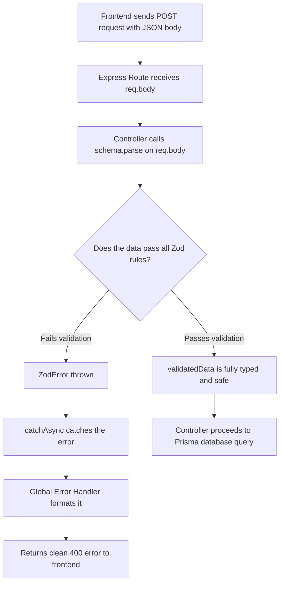

# Detailed Breakdown: `server/schemas/index.ts`

## 1. Overview & Importance
This file contains all **Zod Validation Schemas** for the entire application. Before our Express controllers allow any data to touch the database, the data must pass through these schemas.

**What problem it solves:**
In the original project, if a user tried to create a Task with a 1-character title or an invalid priority like `"SUPER_HIGH"`, the server would either crash or save garbage data. Zod solves this by letting us declare strict "Rules" (schemas). If the incoming data breaks any rule, Zod instantly throws a clean error that our Global Error Handler formats into a human-readable message.

**Alternatives Considered:**
*   **Joi / Yup:** Older validation libraries. Rejected because they do not integrate well with TypeScript and require manually writing separate type definitions.
*   **Manual If-Statements:** Rejected because it makes controller files massive and hard to read.
*   **Zod (Chosen):** The modern industry standard. TypeScript-first, meaning validated data is automatically typed.

---

## 2. Line-by-Line Breakdown

### Auth Schemas
```typescript
export const registerSchema = z.object({
  name: z.string().min(2, "Name must be at least 2 characters"),
  email: z.string().email("Invalid email address"),
  password: z.string().min(6, "Password must be at least 6 characters"),
});
```
*   **Why we used it:** This single `.parse()` call replaces 10+ lines of manual validation. If the password is only 3 characters, Zod instantly throws an error. We don't even need an `if` statement.

```typescript
export const loginSchema = z.object({
  email: z.string().email("Invalid email address"),
  password: z.string().min(1, "Password is required"),
});
```
*   **Why we used it:** Login only needs to verify that both fields exist and the email is in valid format. We use `.min(1)` instead of `.min(6)` because we don't want to reveal our password length rules to potential attackers during login.

### Project Schemas
```typescript
export const createProjectSchema = z.object({
  name: z.string().min(2, "Project name must be at least 2 characters"),
  description: z.string().optional(),
});
```
*   **Why we used it:** When creating a project, only the name is required. The description is optional (`.optional()` means the field can be missing entirely or `undefined`).

```typescript
export const updateProjectSchema = z.object({
  name: z.string().min(2).optional(),
  description: z.string().optional(),
  status: z.enum(["ACTIVE", "ARCHIVED"]).optional(),
});
```
*   **Why we used it:** When updating a project, ALL fields are optional (a "Partial Update" or "PATCH" pattern). The user might only want to change the name without touching the description. The `z.enum()` ensures the status can only be one of the two values defined in our Prisma schema.

### Task Schemas
```typescript
export const createTaskSchema = z.object({
  title: z.string().min(2, "Task title must be at least 2 characters"),
  description: z.string().optional(),
  status: z.enum(["TODO", "IN_PROGRESS", "REVIEW", "COMPLETED"]).optional(),
  priority: z.enum(["LOW", "MEDIUM", "HIGH", "CRITICAL"]).optional(),
  dueDate: z.string().optional(),
  assigneeId: z.string().uuid().optional(),
});
```
*   **Why we used it:** Tasks have the most complex validation. Notice `z.enum()` matches exactly the Prisma Enums we defined in `schema.prisma`. The `assigneeId` uses `.uuid()` to ensure it's a valid UUID format, preventing SQL injection attempts through malformed IDs.


### Collaboration Schemas (Members, Messages, Comments)
```typescript
export const addMemberSchema = z.object({
  email: z.string().email("Please provide a valid email address."),
});

export const messageSchema = z.object({
  content: z.string().min(1, "Message cannot be empty"),
});

export const commentSchema = z.object({
  content: z.string().min(1, "Comment cannot be empty"),
});
```
*   **Why we used it:** These are intentionally kept simple. We just need to make sure the user isn't sending completely empty strings or malformed emails before letting it hit our controllers.

---

## 3. Data Flow



---

## 4. How it links to other files
*   **To `server/controllers/auth.ts`:** Imports `registerSchema` and `loginSchema` to validate registration and login data.
*   **To `server/controllers/projects.ts` (future):** Will import `createProjectSchema` and `updateProjectSchema`.
*   **To `server/controllers/tasks.ts` (future):** Will import `createTaskSchema` and `updateTaskSchema`.
*   **From `prisma/schema.prisma`:** The `z.enum()` values in our schemas must exactly match the Prisma Enums defined there. If we add a new TaskStatus in Prisma, we must also add it here.
