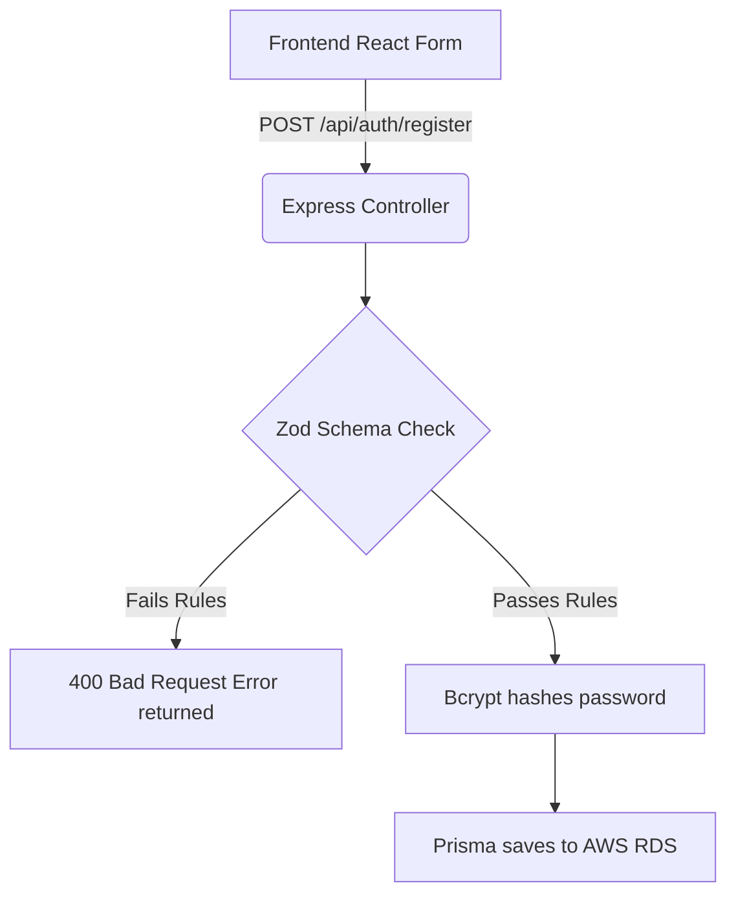

# Detailed Breakdown: `server/schemas/index.ts`

## 1. Overview & Importance
This file contains our **Zod Validation Schemas**. Before our Express server allows any data to touch the database, the data must pass through these schemas. 

**What problem it solves:**
In the original project, if a user tried to register with a fake email like `"hello_world"`, the server would save bad data. Zod solves this by letting us declare "Rules" (schemas). If the incoming data breaks a rule, Zod automatically throws a clean error back to the frontend.

**Alternatives Considered:**
*   **Joi / Yup:** Older validation libraries. Rejected because they do not integrate well with TypeScript. 
*   **Manual If-Statements:** Rejected because it makes route files massive and hard to read.
*   **Zod (Chosen):** The modern industry standard.

---

## 2. Data Flow

