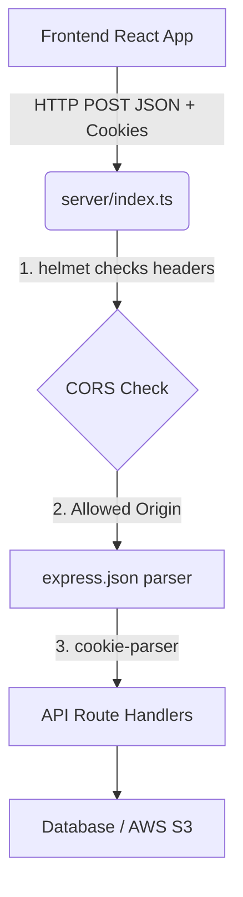

# Detailed Breakdown: `server/index.ts`

## 1. Overview & Importance
The `server/index.ts` file is the entry point for our entire backend. Whenever we start our backend, Node.js executes this file first. It sets up Express, configures all the security middlewares, and eventually (in Day 2 and Day 3) will connect all of our specific API routes (`/api/tasks`, `/api/users`).

**What problem it solves:**
In the original, broken project, the `server.ts` file was over 1,000 lines long. It contained database logic, API routes, email sending, and file uploading all mashed together. That is called a "Monolithic" file and it makes fixing bugs incredibly difficult. We solve this by making `index.ts` purely a "Traffic Cop". It doesn't process tasks itself; it just configures security and routes traffic to specialized files.

**Alternatives Considered:**
*   **Next.js API Routes:** We could have used a fullstack framework like Next.js where the frontend and backend are inherently merged. Rejected because you specifically wanted to learn how to build a decoupled Express.js backend for your Backend Engineering resume.
*   **Fastify / NestJS:** Other backend frameworks. Rejected because Express.js is the absolute industry standard, making it the most important framework to have on a junior/mid-level resume.

---

## 2. Line-by-Line Breakdown

### The Environment
```typescript
import 'dotenv/config';
```
*   **Why we used it:** This must be the very first line. It grabs your `.env` file and loads your AWS secrets into Node.js so that `process.env.DATABASE_URL` works instantly.

### Core Architecture
```typescript
import express from 'express';
const app = express();
```
*   **Why we used it:** Initializes the Express framework to handle HTTP requests.

### Security Middlewares
```typescript
app.use(helmet({ contentSecurityPolicy: false }));
app.use(cors({
  origin: process.env.APP_URL || 'http://localhost:3000',
  credentials: true
}));
app.use(express.json({ limit: '10mb' }));
app.use(cookieParser());
```
*   **`helmet`:** A massive security upgrade. It automatically adds 14 different HTTP headers to protect against common web vulnerabilities (like Cross-Site Scripting).
*   **`cors`:** Cross-Origin Resource Sharing. Without this, your React frontend (running on port 5173) would be blocked from talking to your Express backend (running on port 3000). The `credentials: true` part is **critical**—it allows the browser to send our secure JWT cookies. The original project had bugged CORS settings.
*   **`express.json`:** Parses incoming JSON data so we can read `req.body.password`.
*   **`cookieParser`:** Parses incoming cookies so we can securely read the user's JWT token without them having to send it manually in every request.

---

## 3. Data Flow



## 4. How it links to other files
Right now, it is very simple. But starting on Day 2, we will create files inside `server/routes/` (like `server/routes/auth.ts`). We will then import them into this `index.ts` file and mount them like this: `app.use('/api/auth', authRoutes)`. This keeps `index.ts` clean and readable no matter how big the app gets.
