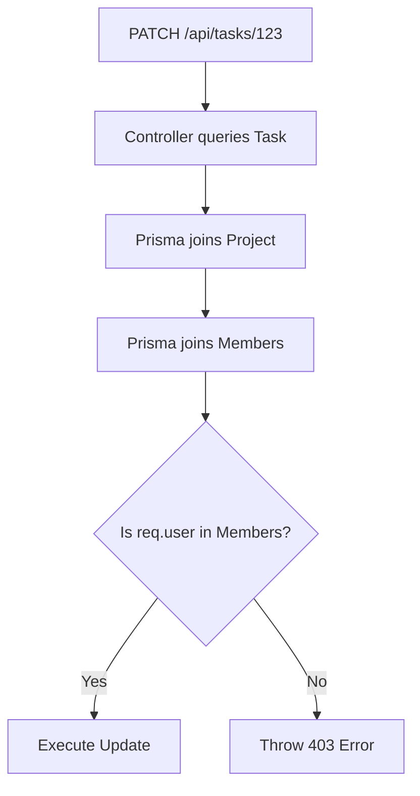

# Detailed Breakdown: `server/controllers/tasks.ts`

## 1. Overview & Importance
This file contains the business logic for managing **Tasks**. Tasks are the most highly-relational data models in our application because they are simultaneously tied to:
1.  A **Project** (where the task lives)
2.  A **Creator** (the User who made the task)
3.  An **Assignee** (the User who is supposed to complete the task)

**What problem it solves:**
Just like Projects, Tasks require strict **Data Isolation**. We cannot allow a user to create a task inside a project they don't belong to. This controller enforces relational security at every step.

**Pro Upgrades Implemented:**
1.  **Query Parameter Architecture:** Instead of putting `projectId` in the URL path (like `/api/projects/123/tasks`), we use Query Parameters (`/api/tasks?projectId=123`). This keeps our routing flatter and cleaner, which is a modern REST API best practice.
2.  **Relational Security Checks:** Before we update a task, we use Prisma's nested includes (`include: { project: { include: { members: true } } }`) to walk *up* the relationship tree from the Task to the Project, and check if the logged-in user is a member of that parent project.
3.  **Strict Ownership Rules:** For deletions, being a member of the project isn't enough. We enforce that **only the person who created the task (or a global ADMIN) can delete it**. This prevents team members from accidentally (or maliciously) deleting each other's tasks.

---

## 2. Line-by-Line Breakdown

### Create Task
```typescript
const { projectId } = req.query; 

if (!projectId || typeof projectId !== 'string') {
    throw new AppError('Project ID is required in the query string', 400);
}
```
*   **Why we used it:** We extract the `projectId` from the URL query string (`?projectId=...`). We explicitly check that it exists and is a string. If the frontend forgets to send it, we immediately reject the request with a `400 Bad Request`.

```typescript
const project = await prisma.project.findUnique({
    where: { id: projectId },
    include: { members: { select: { id: true } } }
});
```
*   **Why we used it:** Before creating the task, we must query the parent project to verify it exists and that the user is actually allowed to add tasks to it.

```typescript
const task = await prisma.task.create({
    data: {
        ...validatedData,
        projectId,
        creatorId: req.user.id 
    }
});
```
*   **Why we used it:** We explicitly force `creatorId` to be `req.user.id`. We *never* trust the frontend to tell us who the creator is (otherwise a hacker could forge tasks under the CEO's name). 

### Get All Tasks
```typescript
const tasks = await prisma.task.findMany({
    where: { projectId },
    include: {
        assignee: { select: { id: true, name: true, avatar: true } },
        creator: { select: { id: true, name: true } }
    },
    orderBy: { createdAt: 'desc' }
});
```
*   **Why we used it:** Once we verify the user is a member of the project, we fetch all tasks for that project. We use `include` to JOIN the User table twice: once for the assignee and once for the creator. This way, the React frontend gets the names and avatars it needs to render the task cards without making extra API calls.

### Update Task
```typescript
const task = await prisma.task.findUnique({
    where: { id: req.params.id },
    include: { project: { include: { members: { select: { id: true } } } } }
});
```
*   **Why we used it:** This is a **Nested Include**. We query the Task table, but we tell Prisma to JOIN the Project table, and then JOIN the ProjectMembers table. This allows us to access `task.project.members` in JavaScript to verify the user has permission to edit the task.

### Delete Task
```typescript
if (task.creatorId !== req.user.id && req.user.role !== 'ADMIN') {
    throw new AppError('Only the task creator or an admin can delete this task', 403);
}
```
*   **Why we used it:** This is the **Strict Ownership Rule**. Even if a user is a valid member of the project, if they didn't create the task, they aren't allowed to delete it.

---

## 3. Data Flow (Nested Includes)


