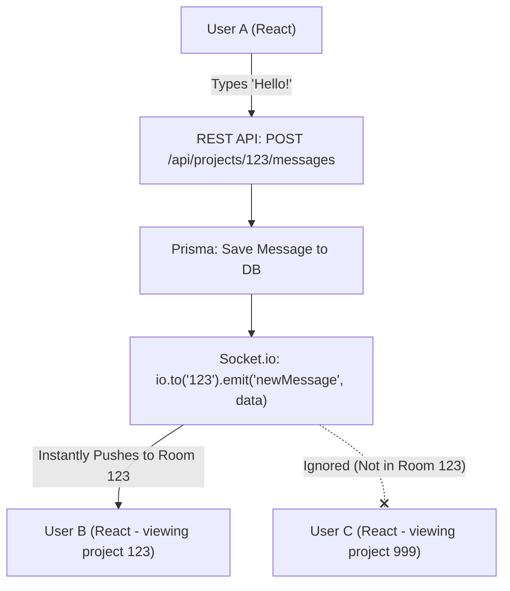

# Detailed Breakdown: Real-Time WebSockets Architecture

## 1. Overview & Importance
Until now, our entire backend has used standard **REST API** architecture. REST is "stateless"—the frontend asks a question, the backend answers, and the connection closes immediately. 

**What problem it solves:**
If User A adds a new task, User B won't see it until they refresh their page (which fires another REST `GET` request). For a modern app (like Slack, Trello, or Jira), this is unacceptable. 

We are implementing **WebSockets** (via `socket.io`). WebSockets create a permanent, two-way open pipe between the browser and the server. The server can push data *down* to the browser without the browser even asking!

**Pro Upgrades Implemented:**
1.  **Room-Based Broadcasting:** We don't want to broadcast a new chat message to *every single user* online. We use Socket.io "Rooms" where the room ID is the `projectId`. This guarantees you only receive real-time updates for the project you are currently viewing.
2.  **Hybrid Architecture:** We don't replace our REST API. We use a hybrid approach. When a user sends a chat message, it goes through our secure REST API (`POST /api/messages`). The controller saves it to the PostgreSQL database, and *then* the controller tells the WebSocket server to broadcast it to the room.

---

## 2. The Hybrid Data Flow

## 3. Implementation Steps
1.  **Attach to HTTP Server:** Express is just a routing framework. We have to extract the raw Node `http.Server` running underneath Express and attach Socket.io to it.
2.  **Connection Listeners:** We set up an event listener `io.on('connection')` that fires every time a user's browser connects.
3.  **Join Rooms:** We listen for a custom event from the frontend (e.g., `join_project`) and use `socket.join(projectId)` to put that user in a specific broadcast room.
